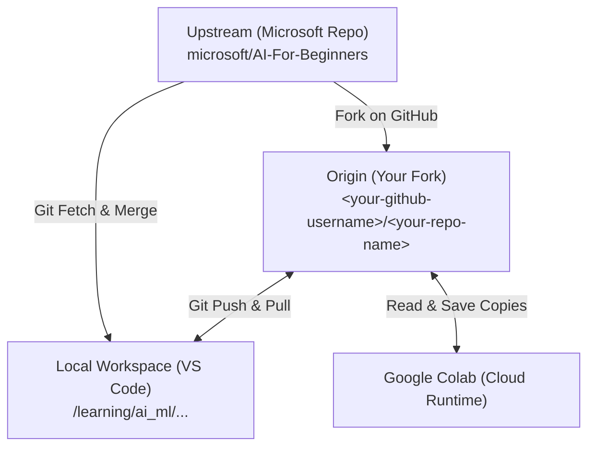

# Repository Architecture & Syncing Best Practices

This document explains how your local learning environment is connected to the official Microsoft curriculum and outlines the best-practice Git configurations to make syncing between VS Code, GitHub, and Google Colab seamless.

---

## 1. The Three-Tier Git Architecture



1. **Upstream (Official Microsoft Repository):**
   * Link: `https://github.com/microsoft/AI-For-Beginners`
   * This is the read-only curriculum source. You pull updates from here, but never write directly to it.
2. **Origin (Your GitHub Fork):**
   * Link: `https://github.com/<your-github-username>/<your-repo-name>`
   * This is your personal cloud copy. Colab writes here, and your local VS Code pushes/pulls from here.
3. **Local Workspace (Your Physical Machine):**
   * Directory: `~/learning/ai_ml/microsoft_ai_for_beginners`
   * This is where you run models locally using your RTX GPU.

---

## 2. Best-Practice Configurations

To keep these three environments perfectly in sync without merge conflicts or credential prompts, apply these configurations:

### A. Add the Upstream Remote (Done)
Linking the upstream repository allows you to pull Microsoft's official updates directly from your terminal:
```bash
git remote add upstream https://github.com/microsoft/AI-For-Beginners.git
```

### B. Pull Strategy Configuration
When you run `git pull`, if there are commits on both Colab (Origin) and Local (VS Code), Git needs to reconcile them. Setting Git to default to standard merges is the most reliable method for Jupyter Notebooks:
```bash
git config pull.rebase false
```

### C. Git Credential Helper
Ensure your Git credentials are cached so you do not get prompted for passwords when pushing or pulling:
```bash
# Instructs Git to use the system credential store
git config --global credential.helper cache
# (Optional) Set the cache to expire after 1 day (86400 seconds)
git config --global credential.helper 'cache --timeout=86400'
```

---

## 3. The Sync Loop (Step-by-Step Workflow)

Follow this cycle to move your progress between systems without conflicts.

### Phase 1: Local to Colab
1. **Locally:** Create or work on your practice file (e.g. `lesson_practice.ipynb`).
2. **Commit & Push locally:**
   ```bash
   git add .
   git commit -m "Save local progress"
   git push origin main
   ```
3. **In Colab:** Go to `colab.research.google.com` -> GitHub tab -> search `<your-github-username>/<your-repo-name>`. Open your practice notebook.

### Phase 2: Colab back to Local
1. **In Colab:** Edit your practice notebook.
2. **Save back to GitHub:** Go to `File -> Save a copy in GitHub`. Select your repo and path.
3. **Locally (Before starting VS Code):** Open your terminal and run:
   ```bash
   git pull origin main
   ```

---

## 4. Syncing Official Upstream Updates

If Microsoft releases new lessons or updates, you can merge them into your environment directly from the terminal:

```bash
# 1. Download Microsoft's latest changes
git fetch upstream

# 2. Merge them into your local main branch
git merge upstream/main

# 3. Push the combined changes up to your personal GitHub fork
git push origin main
```
*Note: Because you never edit the original course notebooks (you only edit your `*_practice.ipynb` copies), this merge will execute cleanly without conflicts.*
